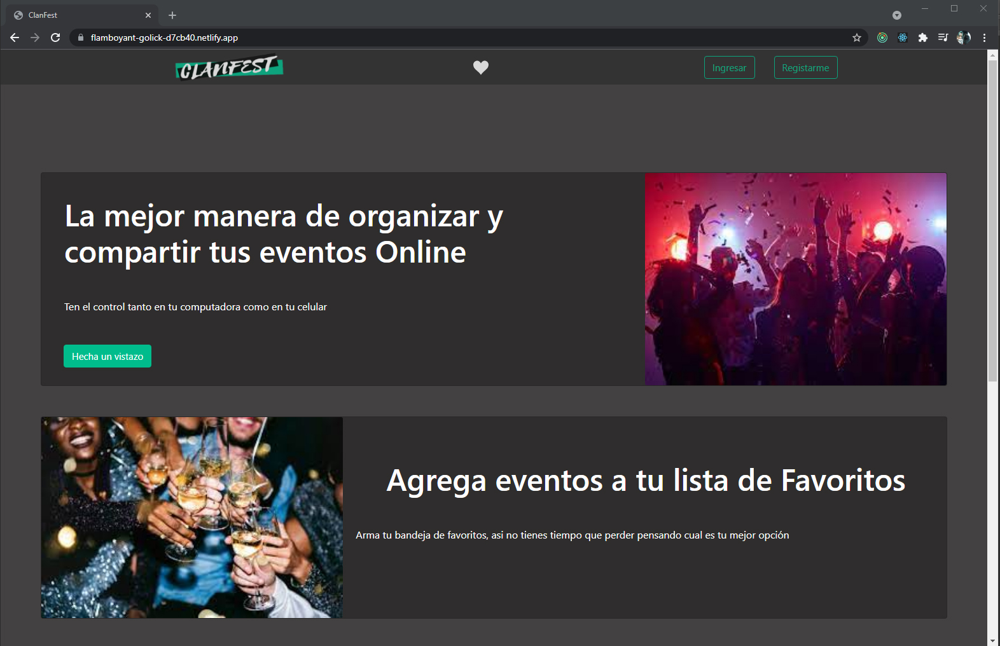
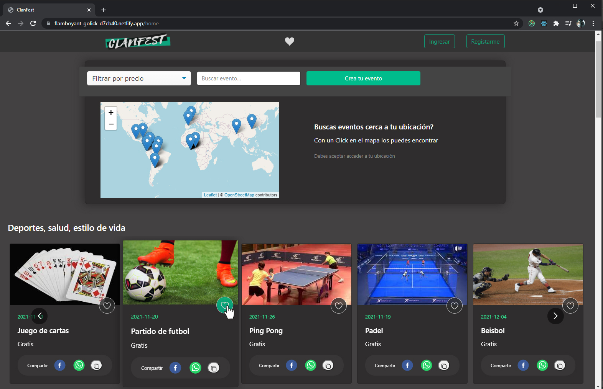
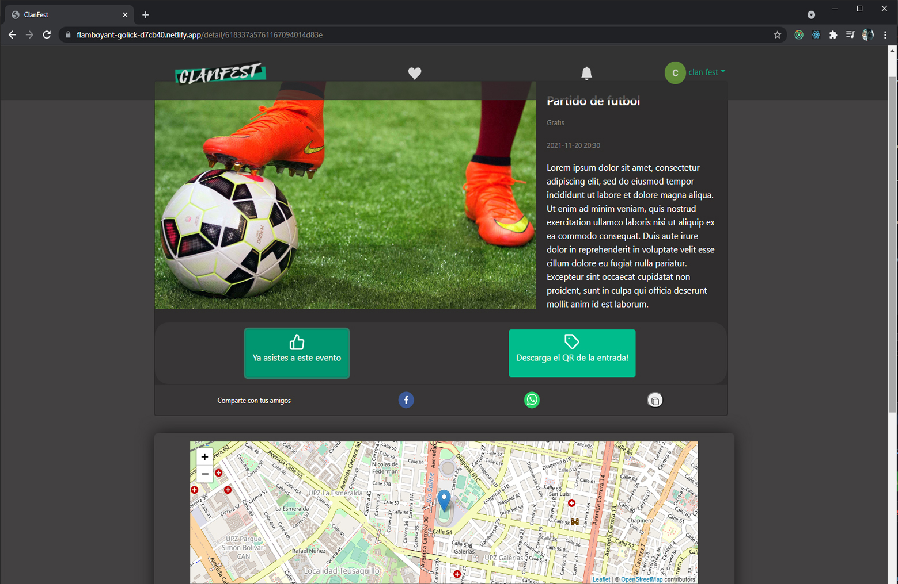
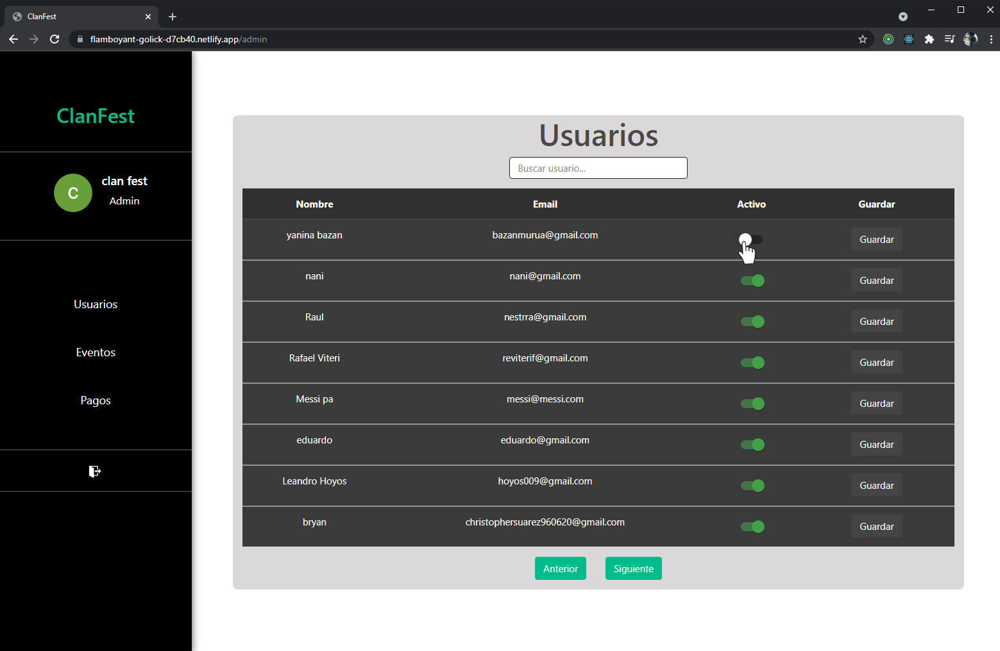
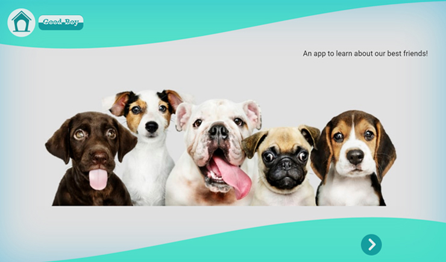
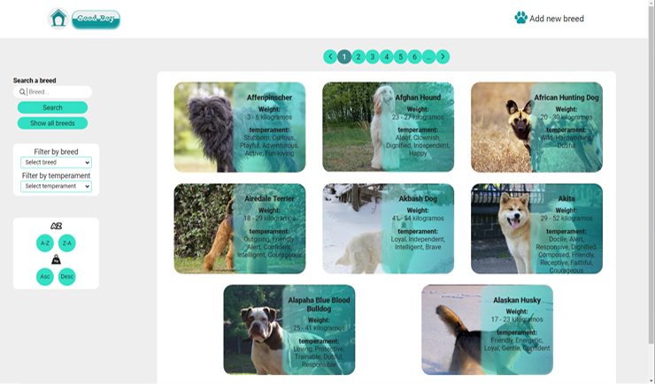
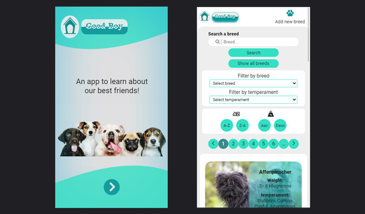

<h2 align="center"> Hi there I´m <a href="https://nanibm.github.io/NaniBMPortfolio/" target="_blank">Nani</a> 👋</h2>

  

 
Welcome to my profile! I am a full stack software developer and biomedical engineering student. I aspire to become a great programmer and be able to create interesting and useful applications that help improve the health of all species.
 
 

- 🔭 I’m currently working at <a href="https://www.tryfondo.com">**Fondo**</a>
- 🌱 I’m currently learning **Django**
- 📫 How to reach me: 
  - <a href="https://www.linkedin.com/in/yaninabazanmurua/" target="_blank">Yanina Janet Bazan Murua</a> on Linkedin
  - <a href="mailto:bazanmurua@gmail.com">bazanmurua@gmail.com</a>

### Recent Works

<h3><a href="https://flamboyant-golick-d7cb40.netlify.app/" target="_blank">ClanFest App</a></h3>

ClanFest is a web application that allows users to find, create and organize all kinds of events.   
Among the functionalities developed, users will be able to create events, edit created events, 
invite friends and manage event attendees, assigning them tasks or deleting them.    
Users will be able to find events near their location, confirm attendance or purchase tickets 
for the event through the integrated payment platform, Mercado Pago.   
ClanFest includes a notification system, part of it, integrated in the app, built with Socket.io, 
that will send online and offline alerts to users every time another user has interacted with their 
created events or events to attend, also users will receive emails to inform them of these interactions. 

<h4>Backend:</h4>
- <a href="https://github.com/NaniBM/ClanFest-API" target="_blank">GitHub Repo</a> 
- <a href="https://api-fest.herokuapp.com" target="_blank">Deployed API</a> 
- Created using: JavaScripte | NodeJS | Express | MongoDB | Mongoose | Socket.io  
- Deployed with: Mongo Atlas + Heroku   

<h4>FrontEnd</h4>
- <a href="https://github.com/christopherBryan1996/PF" target="_blank">GitHub Repo</a>  
- <a href="https://flamboyant-golick-d7cb40.netlify.app/" target="_blank">Deployed Project</a> 
- Created using: TypeScript | React | Redux | CSS3 | Bootstrap | Socket.io  
- Deployed with: Netlify   
 

 
   
    
  
  
   

<h3> <a href="https://github.com/NaniBM/DogAppPI" target="_blank">Dogs App</a></h3>
An app built for Henry's bootcamp, which consisted of the development of a single page application that allows users to learn or obtain information about dog breeds.

- <a href="https://github.com/NaniBM/DogAppPI" target="_blank">GitHub Repo</a>  
- Created using: JavaScript | React | Redux | CSS | PostgreSQL | Sequelize | NodeJS | Express  

 
   
  
  
   

 

### Skills

<h4>Programming languages | Frameworks | Libraries | Database</h4>

  
  
  
  
  
    
    
  
     
  
    
    
  
  
  
     
  
  
  
  
  
  
     
   

<h4> Cloud Hosting | Other tools </h4> 

  
  
  
  
  
    
   
  
   

<!--
**NaniBM/NaniBM** is a ✨ _special_ ✨ repository because its `README.md` (this file) appears on your GitHub profile.

Here are some ideas to get you started:

- 🔭 I’m currently working on ...
- 🌱 I’m currently learning ...
- 👯 I’m looking to collaborate on ...
- 🤔 I’m looking for help with ...
- 💬 Ask me about ...
- 📫 How to reach me: ...
- 😄 Pronouns: ...
- ⚡ Fun fact: ...
-->
