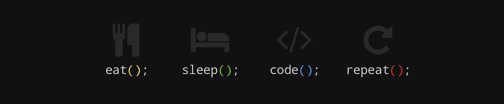

<h2> Hi there I´m <a href="https://nanibm.github.io/NaniBMPortfolio/" target="_blank">Nani</a> 👋</h2>

Welcome to my profile! I am a full stack web developer and biomedical engineering student. I aspire to become a great programmer and be able to create interesting and useful applications that help improve the health of all species.

- 🔭 I’m currently working on  **A platform to organize and find events.**
- 🌱 I’m currently learning **TypeScript and React Native**
- 📫 How to reach me: <a href="https://www.linkedin.com/in/yaninabazanmurua/" target="_blank">Yanina Janet Bazan Murua</a> on Linkedin

<!--
**NaniBM/NaniBM** is a ✨ _special_ ✨ repository because its `README.md` (this file) appears on your GitHub profile.

Here are some ideas to get you started:

- 🔭 I’m currently working on ...
- 🌱 I’m currently learning ...
- 👯 I’m looking to collaborate on ...
- 🤔 I’m looking for help with ...
- 💬 Ask me about ...
- 📫 How to reach me: ...
- 😄 Pronouns: ...
- ⚡ Fun fact: ...
-->
