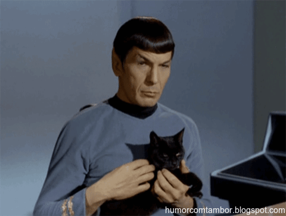

<h2 align="center"> Hi there I´m <a href="https://nanibm.github.io/NaniBMPortfolio/" target="_blank">Nani</a> 👋</h2>

  

 
I am a full stack software developer and biomedical engineering student. I aspire to become a great programmer and be able to create interesting and useful applications that help improve the health of all species.
 
 

- 🔭 I’m currently working at <a href="[https://www.tryfondo.com](https://www.hottocare.com/)">**HottoCare**</a>
- 📫 How to reach me: 
  - <a href="https://www.linkedin.com/in/yaninabazanmurua/" target="_blank">Yanina Janet Bazan Murua</a> on Linkedin
  - <a href="mailto:bazanmurua@gmail.com">bazanmurua@gmail.com</a>

